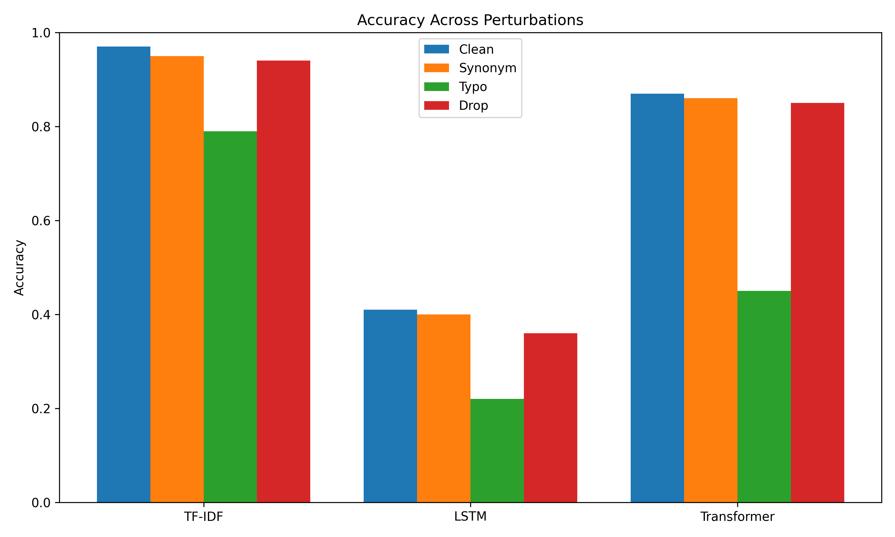
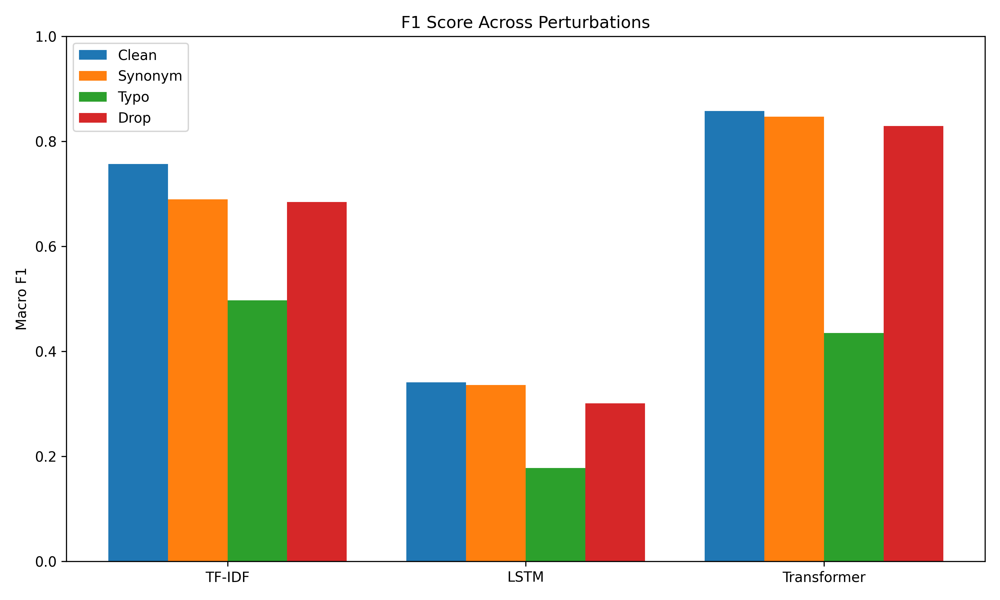
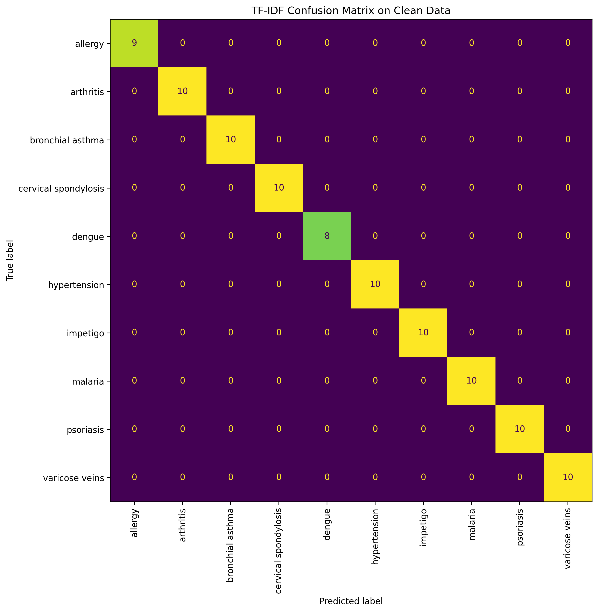
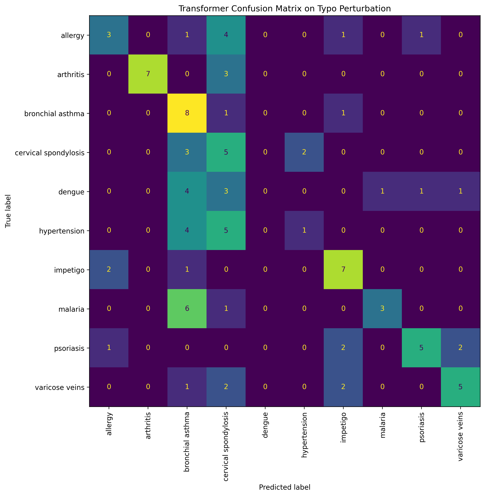

# Robustness of Health Text Classification under Linguistic Perturbations

A comparative study of classical, recurrent, and Transformer-based models for symptom text classification under realistic input perturbations.

---

## Overview

This project studies the robustness of health-related text classification models when the same symptom description is modified through small but realistic language changes. Instead of focusing only on clean accuracy, the project evaluates whether models remain reliable under:

- synonym replacement
- typo noise
- word deletion

The core question is:

> Does the model that performs best on clean symptom text remain the most reliable when the input becomes noisy or slightly reworded?

---

## Task

We perform multi-class classification of symptom descriptions into diagnosis labels and compare model behavior under both clean and perturbed inputs.

For direct comparison across models, all final experiments and robustness evaluations are restricted to the top 10 most frequent diagnosis classes in the dataset.

---

## Dataset

**Source:** `gretelai/symptom_to_diagnosis`

This dataset contains natural-language symptom descriptions paired with diagnosis labels.

### Final evaluation setting
To keep model comparison fair and consistent, the final experiments use the **top 10 most frequent diagnosis classes**.

---

## Models Compared

| Model | Type | Notes |
|---|---|---|
| TF-IDF + Logistic Regression | Classical baseline | Strong lexical matching baseline |
| LSTM | Sequence model | Trained from scratch on the symptom text |
| DistilBERT Transformer | Pretrained Transformer | Fine-tuned for diagnosis classification |

---

## Perturbations

Each model is evaluated under the following settings:

| Perturbation | Description |
|---|---|
| Clean | Original symptom text |
| Synonym | Small lexical substitutions with similar meaning |
| Typo | Character-level corruption / spelling noise |
| Drop | Random word deletion |

In addition, the project includes a **typo stress test** with increasing typo probabilities.

---

## Final Results

### Accuracy

| Model | Clean | Synonym | Typo | Drop |
|---|---:|---:|---:|---:|
| TF-IDF | 0.9700 | 0.9500 | 0.7900 | 0.9400 |
| LSTM | 0.4100 | 0.4000 | 0.2200 | 0.3600 |
| Transformer | 0.8700 | 0.8600 | 0.4500 | 0.8500 |

### Macro F1

| Model | Clean | Synonym | Typo | Drop |
|---|---:|---:|---:|---:|
| TF-IDF | 0.7566 | 0.6893 | 0.4971 | 0.6842 |
| LSTM | 0.3407 | 0.3357 | 0.1775 | 0.3007 |
| Transformer | 0.8575 | 0.8468 | 0.4351 | 0.8293 |

---

## Main Findings

1. **TF-IDF performs best on clean classification**
   
   This suggests that the dataset is relatively small and strongly keyword-driven, making sparse lexical features highly effective.

2. **The Transformer is the most semantically robust**
   
   Its performance changes only slightly under synonym replacement and word deletion, showing stronger contextual understanding.

3. **Typo noise is the hardest perturbation**
   
   All models degrade under spelling corruption, with the largest performance drop appearing under stronger typo noise.

4. **The LSTM underperforms both TF-IDF and the Transformer**
   
   This suggests that sequence models trained from scratch are less effective than both sparse lexical baselines and pretrained contextual models on small health text datasets.

---

## Typo Stress Test

We additionally measured TF-IDF robustness under increasing typo intensity.

| Typo Probability | Accuracy |
|---|---:|
| 0.05 | 0.9600 |
| 0.10 | 0.8800 |
| 0.20 | 0.5100 |
| 0.30 | 0.2500 |

This shows a clear degradation curve under increasing character-level corruption.

---

## Project Pipeline

```text
Symptom Text Input
        ↓
Preprocessing
        ↓
Perturbation Engine
(synonym / typo / drop)
        ↓
Model Evaluation
(TF-IDF / LSTM / Transformer)
        ↓
Metrics + Robustness Analysis
(accuracy / macro F1 / stress testing / qualitative examples)

---

## Results

### Accuracy under Perturbations


### Macro F1 under Perturbations


### Robustness Loss by Perturbation


### Confusion Matrices

#### TF-IDF on Clean Data


#### Transformer on Typo Perturbation


### Full Results
See:
`results/final_summary_table.csv`

### Qualitative Examples
See:
`results/qualitative_examples.csv`